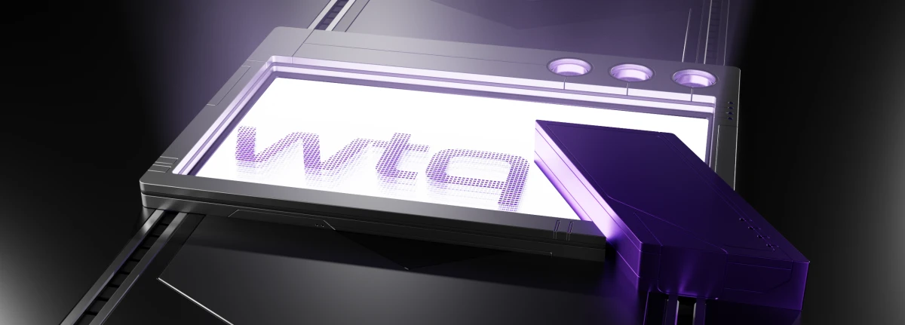

# WTQ v2
### Enable Quake-style dropdown for (almost) any application.
For **Windows 10** & **11**, and **KDE Plasma 5** & **6** (Wayland only).

[](https://github.com/flyingpie/windows-terminal-quake/actions/workflows/ci.yml)



On **Windows 10**, with [Windows Terminal](https://github.com/microsoft/terminal), [Double Commander](https://github.com/doublecmd/doublecmd) and [Process Hacker](https://processhacker.sourceforge.io/).

https://github.com/flyingpie/windows-terminal-quake/assets/1295673/04360031-424e-49c4-b453-47e4f55822b4

On **CachyOS**, with [WezTerm](https://wezfurlong.org/wezterm/index.html), [Dolphin](https://apps.kde.org/dolphin/), [System Monitor](https://apps.kde.org/plasma-systemmonitor/), [KeePassXC](https://keepassxc.org/) and [Spotify](https://www.spotify.com/us/download/).

https://github.com/user-attachments/assets/5a668737-1147-4861-93b6-be637c0d3eaf

On **CachyOS**, combined with [Kando](https://github.com/kando-menu/kando).
<video src="https://github.com/user-attachments/assets/532964f3-2e3b-4c60-9b08-7ffbb3662096" />

- Join the [discussion](https://github.com/flyingpie/windows-terminal-quake/discussions/119)
- Open an [issue](https://github.com/flyingpie/windows-terminal-quake/issues)
- Try a [release](https://github.com/flyingpie/windows-terminal-quake/releases/latest)

## Manual Download
See [the latest release](https://github.com/flyingpie/windows-terminal-quake/releases/latest), and pick a zip.

## Scoop
```
scoop install https://raw.githubusercontent.com/flyingpie/windows-terminal-quake/master/scoop/wtq-latest.json
```

A shortcut is then available named 'WTQ - Windows Terminal Quake', or you can just run 'wtq' from a command line or Win+R.

## WinGet
```
winget install windows-terminal-quake
```

A shortcut is then available named 'wtq', or you can just run 'wtq' from a command line or Win+R.

## Up Next

The main thing for the next release (**2.12.0**) is a GUI to assist with configuring WTQ.


# WTQ v1
WTQ started as a companion app to the new Microsoft's [Windows Terminal](https://github.com/microsoft/terminal), before a rewrite to v2 that supported other apps as well.

If you're missing a feature from v2, feel free to use v1 instead.

Companion program for the new Windows Terminal that enables Quake-style drop down.


- Runs alongside the new [Windows Terminal](https://github.com/microsoft/terminal)
- Toggle using CTRL+~ or CTRL+Q (configurable, see below)
- Shows up on the screen where the mouse is (eg. multi-monitor and multi-workspace)
- Transparency
- Configurable as fullscreen, or partial screen

## Usage
There are a couple of options:

- Download the latest release from the [releases page](https://github.com/flyingpie/windows-terminal-quake/releases).
- Clone/download the source and run **build.ps1** (uses [Cakebuild](https://cakebuild.net/)).
- Clone/download the source and build using Visual Studio.
- Via [scoop](https://scoop.sh): `scoop install https://raw.githubusercontent.com/flyingpie/windows-terminal-quake/master/scoop/windows-terminal-quake.json`

See [the documentation](https://flyingpie.github.io/windows-terminal-quake) for more settings and information.
