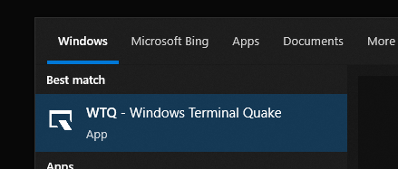
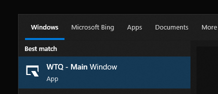
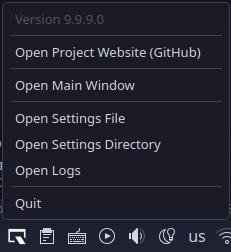
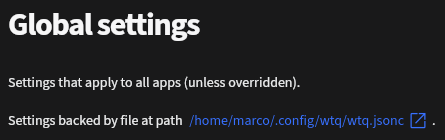
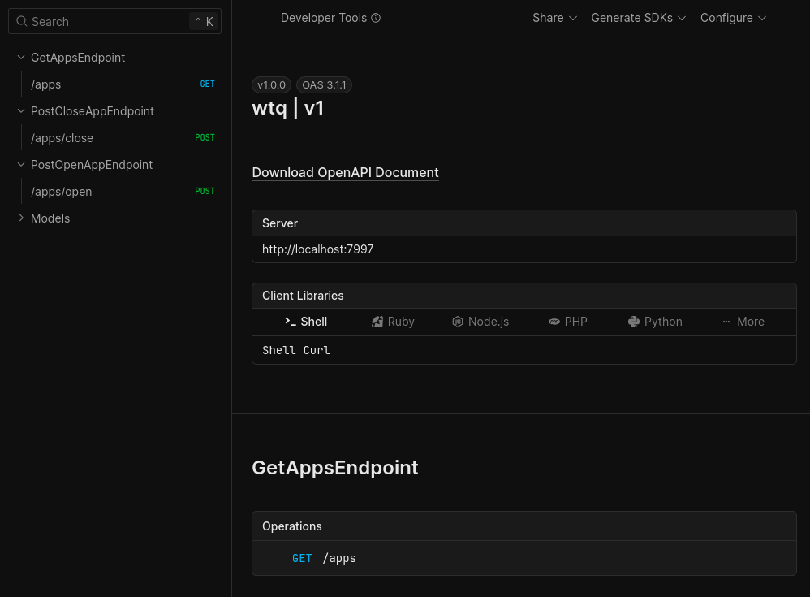
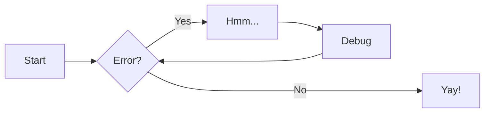

# About

**Welcome to the WTQ docs!**

WTQ runs in the background, and enables sliding applications on- :material-arrow-down: and off :material-arrow-up: the screen, Quake style.

Supports:

- Windows **10** and **11**
- KDE Plasma **5** & **6** (Wayland only)

See [Installation](#installation) to get started.

---

Here's an example where WTQ runs on **Windows 11**, toggling [Windows Terminal](https://github.com/microsoft/terminal), [Q-Dir](https://q-dir.com/), [Process Explorer](https://learn.microsoft.com/en-us/sysinternals/downloads/process-explorer) and [KeePassXC](https://keepassxc.org/).

<video controls loop><source src="/assets/video/wtq-win11.mp4" /></video>

And here's one on **KDE Plasma 6**, toggling [WezTerm](https://wezfurlong.org/wezterm/index.html), [Dolphin](https://apps.kde.org/dolphin/) [System Monitor](https://apps.kde.org/plasma-systemmonitor/) and [KeePassXC](https://keepassxc.org/).

<video controls loop><source src="/assets/video/wtq-kde6-neon.mp4" /></video>

!!! note "Why "Quake" Style"
	The game [Quake (by id Software)](<https://en.wikipedia.org/wiki/Quake_(video_game)>) is generally considered the game that popularized toggling of the console onto the screen, by sliding it from the top.
	See [this video](https://www.youtube.com/watch?v=sDrDK7BigEc) for an example of what that looked like.

!!! note "The "WTQ" Name"
	WTQ initially started as a companion app for Microsoft's thrilling sequel to the classic command prompt; [Windows Terminal](https://github.com/microsoft/terminal).
	Fit that with Quake-style toggling, and you get **"Windows Terminal Quake"**.

	Much later, support for other terminals was added, and support for toggling apps that were not terminals at all.

	So now I refer to it as **"WTQ"**, not having the balls to straight up rename it.

## :material-download: Installation

### :fontawesome-brands-windows: Windows

#### Scoop

[A command-line installer for Windows.](https://scoop.sh/)

!!! note
	The WTQ Scoop package has moved to the Scoop [extras bucket](https://github.com/ScoopInstaller/Extras).

```shell
scoop bucket add extras
scoop install extras/wtq
```

A shortcut is then available named **WTQ - Windows Terminal Quake**, or you can just run `wtq` from a command line or Win+R.


/// caption
Start menu entry after installation.
///

Update (just WTQ):

```shell
scoop update wtq
```

#### WinGet

[The Windows package manager.](https://github.com/microsoft/winget-cli)

```shell
winget install windows-terminal-quake
```

You can then call "**wtq**" from the command line.

After having done that **at least once**, a shortcut will appear in the start menu, called **WTQ - Main Window**.


/// caption
Start menu entry after installation.
///

Update (just WTQ):

```shell
winget upgrade windows-terminal-quake
```

!!! note "Where's WTQ Installed?"
	You can run

	```shell
	winget --info
	```

	To find out where apps are installed:

	```shell
	Windows Package Manager v1.10.340
	(...)
	Portable Package Root (User) %LOCALAPPDATA%\Microsoft\WinGet\Packages
	```

#### Manual

See [the latest release](https://github.com/flyingpie/windows-terminal-quake/releases/latest), and pick a zip.

- **Self-Contained**<br/>Slightly larger, but does not require dependencies to be installed (i.e. .Net).
- **Framework-Dependent**<br/>Smaller, but requires .Net 10 to be installed.

#### Build From Source

!!! note "Dependencies"
	- Requires the [.Net 10 SDK](https://dotnet.microsoft.com/en-us/download) to be installed

You can also clone the repo and run the **Install** build target, which will build and install WTQ: `~/AppData/Local/wtq`.

```shell
git clone https://github.com/flyingpie/windows-terminal-quake.git
cd windows-terminal-quake

./build.ps1 Install
```

Uninstall:

```shell
./build.ps1 Uninstall
```

You can also take a look at the build options, do see more options for building, including without actually installing:

```shell
./build.ps1 --help
```

### :fontawesome-brands-linux: Linux

#### Arch AUR

Multiple versions are published to the Arch User Repository (AUR):

###### [wtq-bin](https://aur.archlinux.org/packages/wtq-bin) (Recommended)

- Latest stable release, pre-built;
- Downloads from GitHub Releases;
- Quicker to install and minimal dependencies.

```bash
yay -S wtq-bin
```

or

```bash
paru -S wtq-bin
```

###### [wtq](https://aur.archlinux.org/packages/wtq)

- Latest stable release, built from source;
- Purist open source, but takes a bit longer to install and has a bit more (build-time) dependencies.

```bash
yay -S wtq
```

or

```bash
paru -S wtq
```

#### Flatpak

Since WTQ only supports KDE Plasma on Linux, it's not a great fit for Flathub.

As an alternative, you can use the Flatpak remote hosted on the [sister repository](https://github.com/flyingpie/flatpak).
It uses the [Flatter](https://github.com/andyholmes/flatter) GitHub Action for building the Flatpak itself, and everything is hosted on GitHub Pages.

The app itself and the Flatpaks are [built entirely from source, using GitHub Actions](https://github.com/flyingpie/flatpak/actions/workflows/flatpak-repo.yml), in the open.

###### Per-User

```bash
flatpak --user remote-add flyingpie https://flatpak.flyingpie.nl/index.flatpakrepo
flatpak --user install nl.flyingpie.wtq
```

###### System-Wide

```bash
flatpak remote-add flyingpie https://flatpak.flyingpie.nl/index.flatpakrepo
flatpak install nl.flyingpie.wtq
```

These permissions are enabled by default:

```bash
--socket=wayland							# (required) So we can run the GUI
--talk-name=org.kde.KWin					# (required) So we can talk to KWin for querying windows
--talk-name=org.kde.StatusNotifierWatcher	# (required) So we can create a tray icon
--talk-name=org.freedesktop.Flatpak			# (optional) So we can start processes (e.g. "flatpak-spawn --host dolphin")
```

#### Manual

!!! note "Dependencies"
	- Requires webkit2gtk-4.1 to be installed

See the [/linux/install-or-upgrade-wtq.sh script](https://github.com/flyingpie/windows-terminal-quake/blob/master/pkg/linux/install-or-upgrade-wtq.sh) that downloads the latest version of WTQ, installs it to `~/.local/share/wtq`, and creates a **wtq.desktop** file.

As a 1-liner:

```bash
bash <(curl -s https://raw.githubusercontent.com/flyingpie/windows-terminal-quake/refs/heads/master/pkg/linux/install-or-upgrade-wtq.sh)
```

And the [/linux/uninstall-wtq.sh uninstall script](https://github.com/flyingpie/windows-terminal-quake/blob/master/pkg/linux/uninstall-wtq.sh).

```bash
bash <(curl -s https://raw.githubusercontent.com/flyingpie/windows-terminal-quake/refs/heads/master/pkg/linux/uninstall-wtq.sh)
```

!!! note "Settings File Remains"
	The WTQ settings are not removed by this script. These are usually located at `~/.config/wtq`, also see [Settings](#settings).

#### Build From Source

!!! note "Dependencies"
	- Requires the [.Net 10 SDK](https://dotnet.microsoft.com/en-us/download) to be installed - Requires webkit2gtk-4.1 to be installed

You can also clone the repo and run the **Install** build target, which will build and install WTQ at `~/.local/share/wtq` (respects XDG spec).

```bash
git clone https://github.com/flyingpie/windows-terminal-quake.git
cd windows-terminal-quake

./build.sh Install
```

Uninstall:

```bash
./build.sh Uninstall
```

You can also take a look at the build options, do see more options for building, including without actually installing:

```bash
./build.sh --help
```

## :material-lightbulb: App examples

!!! danger "TODO"

## :material-monitor: GUI

!!! danger "TODO"

## :material-keyboard: Hotkeys, Keys and KeyChars

Keys can be specified in 2 ways:

- A **virtual key code** (the **Key** property). Generally the preferred method on Windows.

This maps to the **physical key** on the keyboard, regardless of what character it produces.

The hotkey system on Windows sends virtual key codes to WTQ (and _not_ what character it produces). So on Windows, binding on virtual key codes generally works best (as no additional transformations are necessary).

Key codes are also mapped to key characters, so the **KeyChar** property usually still works. But this has some limitations, such as likely needing to restart WTQ when switching keyboard layouts. Hence it's recommended to use **Key** on Windows, which stays closer to the events Windows is sending.

- A **key character** (the **KeyChar** property). Generally the preferred method on Linux.

This maps to the **produced character**, regardless of what physical key was pressed.

On Linux, hotkey presses are sent to WTQ as _typed characters_, taking the keyboard layout into account. So on Linux, binding on key characters generally works best (as no additional transformations are necessary).

Key characters are also mapped to key codes, so the **Key** property usually still works. But this has limitations when the keyboard layout differs from US ANSI, where virtual key codes are based on. Hence it's recommended to use **KeyChar** on Linux, which stays closer to the events Linux is sending.

!!! note
	The [GUI](#gui) can be helpful in figuring out what codes- or characters to use here.

See [this issue](https://github.com/flyingpie/windows-terminal-quake/issues/199) for more information on why the split exists.

See [Global Hotkeys](#hotkeys) to configure hotkeys that trigger the most recent app, and [App Hotkeys](#hotkeys_1) that trigger a specific app.

```json
{
	"Hotkeys": [

		//
		// Using virtual key codes (recommended on Windows)
		//

		// CTRL+Q
		{ "Modifiers": "Control", "Key": "Q" }

		// CTRL+1
		{ "Modifiers": "Control", "Key": "D1" }

		// CTRL,ALT+1
		{ "Modifiers": "Control,Alt", "Key": "D1" },

		// CTRL,SHIFT+Q
		{ "Modifiers": "Control,Shift", "Key": "Q" },

		// All modifiers ("Super" also being known as "Meta", or the "Windows" key)
		{ "Modifiers": "Alt,Control,Shift,Super", "Key": "Q" }

		//
		// Using key characters (recommended on Linux)
		//

		// CTRL+Q
		{ "Modifiers": "Control", "KeyChar": "Q" }

		// CTRL+1
		{ "Modifiers": "Control", "KeyChar": "1" },

		// CTRL,ALT+1
		{ "Modifiers": "Control,Alt", "KeyChar": "1" },

		// CTRL,SHIFT+Q
		{ "Modifiers": "Control,Shift", "KeyChar": "Q" },

		// All modifiers ("Super" also being known as "Meta", or the "Windows" key)
		{ "Modifiers": "Alt,Control,Shift,Super", "KeyChar": "Q" }

	]
	// ...
}
```

## :material-cog: Settings

Settings are stored in a JSON file, usually named `wtq.jsonc`.

The file can use the extension `.json`, `.jsonc` or `.json5`. The latter two are supported, so that editors like VSCode automatically switch to **"JSON with Comments"**, making working with comments nicer.

### Settings File Locations

!!! note "Where's My Settings File?"
	The file can be in several places, to support different use cases and preferences.

	You can quickly open either the settings _file_, or the _directory_ that contains the settings file by clicking the tray icon -> **Open Settings File**, or **Open Settings Directory**.

	
	/// caption
	Tray icon menu options.
	///

	Additionally, it's also displayed in the GUI, with a link for convenience.

	
	/// caption
	Settings location in the GUI.
	///

#### :fontawesome-brands-windows: On Windows

These locations are considered, in order:

1. A path defined by an environment variable named `WTQ_CONFIG_FILE` (regardless of filename or extension)
1. Next to the WTQ executable
	- When using **Scoop**: `C:\Users\username\scoop\apps\wtq-latest\current`
	- When using **WinGet**: `C:\Users\username\AppData\Local\Microsoft\WinGet\Packages\flyingpie.windows-terminal-quake_Microsoft.Winget.Source_8wekyb3d8bbwe`
	- Or wherever else the `wtq.exe` file is
1. In **%USERPROFILE%\\.config**
	- `C:\users\username\.config\wtq.json`
1. In user home
	- `C:\users\username\wtq.json`
1. In user home, as a dot file
	- `C:\users\username\.wtq.json`
1. In app data
	- `C:\users\username\AppData\Roaming\wtq\wtq.json`

If no settings were found at any of these locations, WTQ creates a settings file at `C:\Users\username\AppData\Roaming\wtq\wtq.jsonc`.

#### :fontawesome-brands-linux: On Linux

These locations are considered, in order:

1. A path defined by an environment variable named `WTQ_CONFIG_FILE` (regardless of filename or extension)
1. Next to the WTQ executable
	- When using the install script: `/home/username/.local/share/wtq`
1. In `$XDG_CONFIG_HOME`, if defined (following to the [XDG spec](https://specifications.freedesktop.org/basedir-spec/latest/))
	- `/home/username/.config/wtq.json`
1. In **~/.config** (the default for XDG_CONFIG_HOME, if is it not defined)
	- `/home/username/.config/wtq.json`
1. In user home
	- `/home/username/wtq.json`
1. In user home, as a dot file
	- `/home/username/.wtq.json`

If no settings were found at any of these locations, WTQ creates a settings file at `$XDG_CONFIG_HOME`: `/home/username/.config/wtq/wtq.jsonc`.

!!! danger "TODO"
	TODO: Mention wtq.schema.json

### :material-earth: Global options

Defines WTQ-wide options, including the list of configured apps.

#### General

##### Apps

Applications to enable Quake-style dropdown for.

```json
{
	"Apps": [
		{
			"Name": "App 1"
			// (App settings here)
		},
		{
			"Name": "App 2"
			// (App settings here)
		}
		// ...
	]
}
```

##### Hotkeys

<p>Global hotkeys, that toggle either the first, or the most recently toggled app.</p>
<p>Also note <a href="#hotkeys_1">App Hotkeys</a>, which handles hotkeys for a single particular app.</p>
<p>See <a href="#hotkeys-keys-and-keychars">Hotkeys, Keys and KeyChars</a> for more information and examples.</p>

```json
{
	"Hotkeys": [{ "Modifiers": "Control", "Key": "Q" }]
	// ...
}
```

##### API

<p>WTQ comes with an HTTP API (**disabled** by default), that can be used to control WTQ programmatically.</p>
<p>See the <a href="#http-api">HTTP API section</a> for more information and usage examples.</p>

```json
{
	"Api": {
		"Enable": true,
		"Urls": ["http://127.0.0.1:7997"]
	}
	// ...
}
```

##### Feature flags

<p>Sometimes functionality is added or changed that carries more risk of introducing bugs.</p>
<p>For these cases, such functionality can be put behind a "feature flag", which makes them opt-in or opt-out.</p>
<p>That way, we can still merge to master, and make it part of the stable release version (reducing branches and dev builds and what not),
but still have a way back should things go awry, without necessarily reverting to a previous version.</p>

```json
{
	"FeatureFlags": {
		// (Currently no feature flags available)
	}
	// ...
}
```

##### Show UI on start

Whether to show the GUI when WTQ is started.

```json
{
	"ShowUiOnStart": false | true
	// ...
}
```

##### Tray icon (color) style

The tray icon (color) style (dark/light).

Defaults to `Auto`

- **Auto**<br/>Attempt to detect the OS theme and use the appropriate style based on that (currently Windows only).

- **Dark**<br/>Dark icon, works best on lighter themes.

- **Light**<br/>Light icon, works best on darker themes.

```json
{
	"TrayIconStyle": "Auto | Dark | Light"
	// ...
}
```

#### Animation

##### Animation target FPS

<p>How many frames per second the animation should be.</p>
<p>Note that this may not be hit if moving windows takes too long, hence "target" fps.</p>
<p>Must be between 5 and 120, to prevent issues that can arise with values that are too low or too high.</p>

Defaults to `40`

```json
{
	"AnimationTargetFps": 40
	// ...
}
```

### :material-application-outline: App options

Defines the options for a single toggleable app (eg. Windows Terminal, some other terminal, a file browser, etc.).

#### App

##### Name

<p>A logical name for the app, used to identify it across config reloads, and it appears in logs.</p>

```json
{
	"Apps": [
		{
			"Name": "Terminal"
			// (App settings here)
		}
	]
}
```

##### Hotkeys

<p>One or more keyboard shortcuts that toggle in- and out this particular app.</p>
<p>Also note <a href="#hotkeys">Global Hotkeys</a>, which handles hotkeys that toggle the most recent app.</p>
<p>See <a href="#hotkeys-keys-and-keychars">Hotkeys, Keys and KeyChars</a> for more information and examples.</p>

```json
{
	"Apps": [
		{
			"Hotkeys": [{ "Modifiers": "Control", "Key": "Q" }]
			// ...
		}
	]
	// ...
}
```

#### Process

##### Filename

<p>The **filename** to use when starting a new process for the app. If no <a href="#process-name">ProcessName</a> is set,
the value of this property is also used to match against the names of running processes (to find the process to attach to).</p>
<p>E.g. **notepad**, **dolphin**, etc.</p>
<p>Note that (if the app is not in the OS PATH), you can also put absolute paths in here,
or specify the working directory through <a href="#working-directory">WorkingDirectory</a>.</p>

```json
{
	"Apps": [
		{
			"FileName": "wt" | "wezterm-gui" | "spotify" | etc.
			// ...
		}
	]
}
```

##### Arguments

<p>Command-line arguments that should be passed to the app when it's started.</p>
<p>Note that this only applies when using an **AttachMode** that starts the app.</p>
<p>This is mostly here for backward-compatibility reasons. Prefer <a href="#argument-list">ArgumentList</a>,
which handles complex arguments and escaping better.</p>

```json
{
	"Apps": [
		{
			"Arguments": null | "arg1 arg2"
			// ...
		}
	]
}
```

##### Argument list

<p>Command-line arguments that should be passed to the app when it's started.</p>
<p>Note that this only applies when using an **AttachMode** that starts the app (i.e., when WTQ actually starts the app).</p>

```json
{
	"Apps": [
		{
			"ArgumentList": ["--allow-screencapture", "--debug-info"]
			// ...
		}
	]
}
```

##### Working directory

<p>Working directory when starting a new process.</p>
<p>Useful if the **filename** isn't available through PATH.</p>

```json
{
	"Apps": [
		{
			"WorkingDirectory": null | "/path/to/dir" | "C:/path/to/dir" | "C:\\path\\to\\dir"
			// ...
		}
	]
}
```

##### Process name

<p>Apps sometimes have **process names** different from their **filenames**.
This field can be used to look for the process name in such cases. Windows Terminal is an
example, with filename **wt**, and process name **WindowsTerminal**.</p>
<p>Supports regular expressions.</p>
<p>Also see <a href="#app-examples">App Examples</a> for more cases where this is relevant, and the <a href="#gui">GUI section</a> on how to find values.</p>

```json
{
	// Using with Windows Terminal requires both "Filename" and "ProcessName".
	"Apps": [
		{
			"Filename": "wt",
			"ProcessName": "^WindowsTerminal$"
			// ...
		}
	]
}
```

##### Main window

<p>(Windows only) Matches only "main" windows; the initial window a process spawns.</p>
<p>When a process spawns multiple windows, 1 is usually the "main" window. In many cases, this is also the window
that you'd want to use WTQ with. Non-main-windows are usually child windows like popups and such.
When the other (non-main) windows cannot be easily differentiated from the main window (for example through
the window class or -title), the "is-main-window"-property can be very useful to home in on the desired window.</p>
<p>A common example of an app where this would **not** help, is a browser, that can spawn tons of windows on the same process name.</p>

Defaults to `Either`

- **MainWindowOnly**<br/>Match main windows only.

- **NonMainWindowOnly**<br/>Match non-main windows only.

- **Either**<br/>Match main- and non-main windows.

```json
{
	"Apps": [
		{
			"MainWindow": "Either"
			// ...
		}
	]
}
```

##### Window class

<p>(Windows only) Matches windows based on their Win32 Window Class.</p>
<p>Supports regular expressions.</p>
<p>Also see <a href="#app-examples">App Examples</a> for more cases where this is relevant, and the <a href="#gui">GUI section</a> on how to find values.</p>

```json
{
	"Apps": [
		{
			"WindowClass": "^ApplicationFrameWindow$"
			// ...
		}
	]
}
```

##### Window title

<p>Match windows based on their title (sometimes referred to as "caption").</p>
<p>Supports regular expressions.</p>

```json
{
	"Apps": [
		{
			"WindowTitle": "^Mozilla Firefox - WhatsApp$"
			// ...
		}
	]
}
```

#### Behavior

##### Window title override

<p>Attempt to set the window title to a specific value.</p>
<p>Useful for cases where multiple programs control window placement (such as when
using WTQ together with a window manager) and the window title can be used to
opt-out in the other program.</p>
<p>Note that this doesn't work for all windows, as it depends on factors like the app's GUI toolkit.</p>

```json
{
	"Apps": [
		{
			"WindowTitleOverride": "New Window Title"
			// ...
		}
	]
}
```

### :material-cogs: Shared options

Options that are available both in global- and per-app options.

#### Process

##### Attach mode

<p>How WTQ should get to an instance of a running app.</p>
<p>I.e. whether to start an app instance if one cannot be found.</p>

Defaults to `FindOrStart`

- **Find**<br/>Only look for **existing** app instances (but don't create one).

- **FindOrStart**<br/>Look for an **existing** app instance, **create one** if one does not exist yet.

- **Manual**<br/>Attach to **whatever app is in the foreground** when pressing an assigned hotkey.

```json
{
	// Globally:
	"AttachMode": "FindOrStart",

	// For one app only:
	"Apps": [
		{
			"AttachMode": "FindOrStart"
		}
	]
}
```

#### Behavior

##### Always on top

Whether the app should always be on top of other windows, regardless of whether it has focus.

```json
{
	// Globally:
	"AlwaysOnTop": "False",

	// For one app only:
	"Apps": [
		{
			"AlwaysOnTop": "False"
		}
	]
}
```

##### Hide on focus lost

Whether the app should be toggled off when another app gets focus.

Defaults to `Always`

- **Always**<br/>Toggle off the app when focus is lost.

- **Never**<br/>Do not toggle off the app when focus is lost.

```json
{
	// Globally:
	"HideOnFocusLost": "Always",

	// For one app only:
	"Apps": [
		{
			"HideOnFocusLost": "Always"
		}
	]
}
```

##### Taskbar icon visibility

When to show the app window icon on the taskbar.

Defaults to `AlwaysHidden`

- **AlwaysHidden**<br/>**Never** show the taskbar icon.

- **AlwaysVisible**<br/>**Always** show the taskbar icon (note that this can look a bit weird when the app is toggled off).

- **WhenAppVisible**<br/>Only show the taskbar icon when the app is toggled **on**.

```json
{
	// Globally:
	"TaskbarIconVisibility": "AlwaysHidden",

	// For one app only:
	"Apps": [
		{
			"TaskbarIconVisibility": "AlwaysHidden"
		}
	]
}
```

##### Opacity

<p>Make the window see-through (applies to the entire window, including the title bar).</p>
<p>0 (invisible) - 100 (opaque).</p>

Defaults to `100`

```json
{
	// Globally:
	"Opacity": "80",

	// For one app only:
	"Apps": [
		{
			"Opacity": "80"
		}
	]
}
```

#### Position

##### Resize app window

Whether to resize the app window when toggling onto the screen, to apply other settings
like HorizontalScreenCoverage.

By setting this to "Never", the app window size will be maintained, effectively disabling some other settings
(like the aforementioned HorizontalScreenCoverage).

This is useful for cases when resizing an app's window heavily impacts its contents, such as when resizing a
window clears its contents (seems to be most common with Electron apps).

Defaults to `Always`

- **Always**<br/>Always resize the app window to match the alignment settings (like HorizontalScreenCoverage).

- **Never**<br/>Never resize the app window, ignoring alignment settings (like HorizontalScreenCoverage).
  Useful for apps that don't respond well to resizes.

```json
{
	// Globally:
	"Resize": "Always",

	// For one app only:
	"Apps": [
		{
			"Resize": "Always"
		}
	]
}
```

##### Horizontal screen coverage

Horizontal screen coverage, as a percentage.

Defaults to `95`

```json
{
	// Globally:
	"HorizontalScreenCoverage": "95",

	// For one app only:
	"Apps": [
		{
			"HorizontalScreenCoverage": "95"
		}
	]
}
```

##### Horizontal align

Where to position an app on the chosen monitor, horizontally.

Defaults to `Center`

- **Center**<br/>Center of the screen.

- **Left**<br/>Left of the screen.

- **Right**<br/>Right of the screen.

```json
{
	// Globally:
	"HorizontalAlign": "Center",

	// For one app only:
	"Apps": [
		{
			"HorizontalAlign": "Center"
		}
	]
}
```

##### Vertical screen coverage

Vertical screen coverage as a percentage (0-100).

Defaults to `95`

```json
{
	// Globally:
	"VerticalScreenCoverage": "95",

	// For one app only:
	"Apps": [
		{
			"VerticalScreenCoverage": "95"
		}
	]
}
```

##### Vertical offset

How much room to leave between the top of the app window and the top of the screen, in pixels.

```json
{
	// Globally:
	"VerticalOffset": "0",

	// For one app only:
	"Apps": [
		{
			"VerticalOffset": "0"
		}
	]
}
```

##### Off-screen locations

<p>When moving an app off the screen, WTQ looks for an empty space to move the window to.</p>
<p>Depending on your monitor setup, this may be above the screen, but switches to below if another monitor exists there.</p>
<p>By default, WTQ looks for empty space in this order: Above, Below, Left, Right.</p>
<p>If no free space can be found in any of the specified locations, the app will just blink on- and off the screen,
without any animation.</p>

```json
{
	// Globally:
	"OffScreenLocations": ["Above", "Below", "Left", "Right"],

	// For one app only:
	"Apps": [
		{
			"OffScreenLocations": ["Above", "Below", "Left", "Right"]
		}
	]
}
```

#### Monitor

##### Prefer monitor

Which monitor to preferably toggle the app onto.

Defaults to `WithCursor`

- **WithCursor**<br/>The monitor where the mouse cursor is currently at.

- **AtIndex**<br/>The monitor at the index as specified by **MonitorIndex** (0-based).

- **Primary**<br/>The monitor considered **primary** by the OS.

```json
{
	// Globally:
	"PreferMonitor": "WithCursor",

	// For one app only:
	"Apps": [
		{
			"PreferMonitor": "WithCursor"
		}
	]
}
```

##### Monitor index

<p>If **PreferMonitor** is set to **AtIndex**, this setting determines what monitor to choose.</p>
<p>Zero based, e.g. 0, 1, etc.</p>

```json
{
	// Globally:
	"MonitorIndex": "0",

	// For one app only:
	"Apps": [
		{
			"MonitorIndex": "0"
		}
	]
}
```

#### Animation

##### Animation duration

How long the animation should take, in milliseconds.

Defaults to `250`

```json
{
	// Globally:
	"AnimationDurationMs": "250",

	// For one app only:
	"Apps": [
		{
			"AnimationDurationMs": "250"
		}
	]
}
```

##### Animation type (toggle ON)

The animation type to use when toggling on an application.

Defaults to `EaseOutQuart`

- **Linear**<br/>

- **EaseInOutSine**<br/>

- **EaseInBack**<br/>

- **EaseInCubic**<br/>

- **EaseInQuart**<br/>

- **EaseOutBack**<br/>

- **EaseOutCubic**<br/>

- **EaseOutQuart**<br/>

```json
{
	// Globally:
	"AnimationTypeToggleOn": "EaseOutQuart",

	// For one app only:
	"Apps": [
		{
			"AnimationTypeToggleOn": "EaseOutQuart"
		}
	]
}
```

##### Animation type (toggle OFF)

The animation type to use when toggling off an application.

Defaults to `EaseInQuart`

- **Linear**<br/>

- **EaseInOutSine**<br/>

- **EaseInBack**<br/>

- **EaseInCubic**<br/>

- **EaseInQuart**<br/>

- **EaseOutBack**<br/>

- **EaseOutCubic**<br/>

- **EaseOutQuart**<br/>

```json
{
	// Globally:
	"AnimationTypeToggleOff": "EaseInQuart",

	// For one app only:
	"Apps": [
		{
			"AnimationTypeToggleOff": "EaseInQuart"
		}
	]
}
```

#### Events

##### Event hooks

Execute a program when some event occurs.

```json
{
	// Globally:
	"EventHooks": "None",

	// For one app only:
	"Apps": [
		{
			"EventHooks": "None"
		}
	]
}
```

## :material-chat: Event Hooks

When WTQ is running, various events occur, which can be hooked to trigger some action.

!!! note "Event Hooks"
	For going the other direction, where you tell WTQ to do something, see [HTTP API](#http-api).

For example, to execute a script whenever an app is toggled **on**:

```json
{
	"EventHooks": [
		{
			"EventPattern": "AppToggledOn",
			"FileName": "some-script",
			"WorkingDirectory": "/path/to/script"
		}
	]
}
```

The **EventPattern** property accepts regular expressions. For example, to hook everything:

```json
{
	"EventHooks": [
		{
			"EventPattern": ".+",
			"FileName": "some-script"
		}
	]
}
```

- **AppToggledOn**: Fired when an app is toggling onto the screen.
- **AppToggledOff**: Fired when an app is toggling off the screen.

Additionally, some environment variables are passed to the executed command:

- **WTQ_EVENT_NAME**: The name of the event that fired;
- **WTQ_APP_NAME**: The app that relates to the event, if any;
- **WTQ_IS_SWITCHING**: "True" if currently switching from one app to another;

### Examples

Running a PowerShell script when toggling, to play a sound:

```ps1
if ($env:WTQ_EVENT_NAME -eq "AppToggledOn")
{
	if ($env:WTQ_IS_SWITCHING -eq "True")
	{
		# Don't do anything (see below)
	}
	else
	{
		$o = ffplay -nodisp -autoexit -loglevel -8 "C:/downloads/on.mp3" | Out-Null
	}
}

if ($env:WTQ_EVENT_NAME -eq "AppToggledOff")
{
	if ($env:WTQ_IS_SWITCHING -eq "True")
	{
		$o = ffplay -nodisp -autoexit -loglevel -8 "C:/downloads/switch.mp3" | Out-Null
	}
	else
	{
		$o = ffplay -nodisp -autoexit -loglevel -8 "C:/downloads/off.mp3" | Out-Null
	}
}
```

And `wtq.jsonc`:

```json
{
	(...)
	"EventHooks": [
		{
			"EventPattern": ".+",
			"FileName": "pwsh",
			"ArgumentList": [ { "Argument": "wtq-sound.ps1" } ],
			"WorkingDirectory": "C:/downloads"
		}
	]
```

The same demo, but in Bash:

```bash
if [ $WTQ_EVENT_NAME = "AppToggledOn" ]; then
	if [ $WTQ_IS_SWITCHING = "True" ]; then
		# Don't do anything (see below)
	else
		ffplay -nodisp -autoexit ~/Downloads/on.mp3 &> /dev/null
	fi
fi

if [ $WTQ_EVENT_NAME = "AppToggledOff" ]; then
	if [ $WTQ_IS_SWITCHING = "True" ]; then
		ffplay -nodisp -autoexit ~/Downloads/switch.mp3 &> /dev/null
	else
		ffplay -nodisp -autoexit ~/Downloads/off.mp3 &> /dev/null
	fi
fi
```

And `wtq.jsonc`:

```json
{
	(...)
	"EventHooks": [
		{
			"EventPattern": ".+",
			"FileName": "bash",
			"ArgumentList": [ { "Argument": "wtq-sound" } ],
			"WorkingDirectory": "~/Downloads"
		}
	]
```

## :material-api: HTTP API

WTQ comes with an HTTP API (**disabled** by default), that can be used to control WTQ programmatically.

!!! warning "Opt-In"
	For clarity, the HTTP API is **disabled by default**. No socket is opened until **enabled manually**.

!!! note "Event Hooks"
	For going the other direction, where WTQ notifies someone else, see [Event Hooks](#event-hooks).

!!! note "Requires Restart"
	Making changes to this part of the settings requires a WTQ restart.

It can be enabled by setting **Enable** to **true**:

```json
{
	"Api": {
		"Enable": true
	}
}
```

By default, the HTTP API is made available through a named pipe (**//pipe:/wtq** on Windows, **/run/user/USERNAME/wtq/wtq.sock** on Linux).
This makes it such that no ports need to be allocated, and no ports are exposed externally.

Though because it can be useful to have a proper socket (for example to be able to use a browser or various HTTP clients), this can be changed using the **Urls** setting, for example **localhost**, on port **7997**:

```json
{
	"Api": {
		"Enable": true,
		"Urls": ["http://127.0.0.1:7997"]
	}
}
```

Once running, the API can be accessed with an HTTP client, or using the WTQ CLI.

The root address of the API will return an [OpenAPI-driven](https://www.openapis.org/) documentation page, with all the available endpoints:



For example, using Curl to fetch all configured apps:

```bash
curl http://localhost:7997/apps | jq
{
	"apps": [
		{
			"name": "KeePassXC",
			"isAttached": true,
			"isOpen": false
		},
		{
			"name": "Dolphin",
			"isAttached": true,
			"isOpen": false
		},
		{
			"name": "WezTerm",
			"isAttached": true,
			"isOpen": true
		}
	]
}
```

Or to open a specific app:

```bash
curl -X POST "http://localhost:7997/apps/open?appName=Dolphin"
```

## :material-excavator: Building From Source

!!! danger "TODO"

## :material-pencil-ruler: Architecture

!!! danger "TODO"


```mermaid
graph LR
  A[Start] --> B{Error?};
  B -->|Yes| C[Hmm...];
  C --> D[Debug];
  D --> B;
  B ---->|No| E[Yay!];
```
