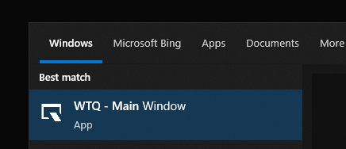
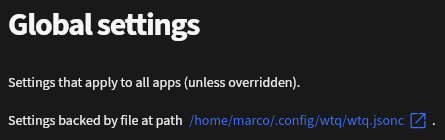

# About

**Welcome to the WTQ docs!**

WTQ runs in the background, and enables sliding applications on- :material-arrow-down: and off :material-arrow-up: the screen, Quake style.

Supports:

- Windows **10** and **11**
- KDE Plasma **5** & **6** (Wayland only)

See [Installation](#installation) to get started.

---

Here's an example where WTQ runs on **Windows 11**, toggling [Windows Terminal](https://github.com/microsoft/terminal), [Q-Dir](https://q-dir.com/), [Process Explorer](https://learn.microsoft.com/en-us/sysinternals/downloads/process-explorer) and [KeePassXC](https://keepassxc.org/).
<video controls loop>
<source src="/assets/video/wtq-win11.mp4" />
</video>

And here's one on **KDE Plasma 6**, toggling [WezTerm](https://wezfurlong.org/wezterm/index.html), [Dolphin](https://apps.kde.org/dolphin/) [System Monitor](https://apps.kde.org/plasma-systemmonitor/) and [KeePassXC](https://keepassxc.org/).
<video controls loop>
<source src="/assets/video/wtq-kde6-neon.mp4" />
</video>

!!! note "Why "Quake" Style"
	The game [Quake (by id Software)](https://en.wikipedia.org/wiki/Quake_(video_game)) is generally considered the game that popularized toggling of the console onto the screen, by sliding it from the top.
	See [this video](https://www.youtube.com/watch?v=sDrDK7BigEc) for an example of what that looked like.

!!! note "The "WTQ" Name"
	WTQ initially started as a companion app for Microsoft's thrilling sequel to the classic command prompt; [Windows Terminal](https://github.com/microsoft/terminal).
	Fit that with Quake-style toggling, and you get **"Windows Terminal Quake"**.

	Much later, support for other terminals was added, and support for toggling apps that were not terminals at all.

	So now I refer to it as **"WTQ"**, not having the balls to straight up rename it.

## :material-download: Installation 

### :fontawesome-brands-windows: Windows

#### Scoop

[A command-line installer for Windows.](https://scoop.sh/)

!!! note
	The WTQ Scoop packages has moved to the Scoop [extras bucket](https://github.com/ScoopInstaller/Extras).

```pwsh
scoop bucket add extras
scoop install extras/wtq
```

A shortcut is then available named **WTQ - Windows Terminal Quake**, or you can just run ```wtq``` from a command line or Win+R.


/// caption
Start menu entry after installation.
///

Update (just WTQ):
```pwsh
scoop update wtq
```

#### WinGet

[The Windows package manager.](https://github.com/microsoft/winget-cli)

```pwsh
winget install windows-terminal-quake
```
You can then call "**wtq**" from the command line.

After having done that **at least once**, a shortcut will appear in the start menu, called **WTQ - Main Window**.


/// caption
Start menu entry after installation.
///

Update (just WTQ):
```pwsh
winget upgrade windows-terminal-quake
```

!!! note "Where's WTQ Installed?"
	You can run

	```pwsh
	winget --info
	```

	To find out where apps are installed:
	```
	Windows Package Manager v1.10.340
	(...)
	Portable Package Root (User)       %LOCALAPPDATA%\Microsoft\WinGet\Packages
	```

#### Manual

See [the latest release](https://github.com/flyingpie/windows-terminal-quake/releases/latest), and pick a zip.

- **Self-Contained**<br/>Slightly larger, but does not require dependencies to be installed (i.e. .Net).
- **Framework-Dependent**<br/>Smaller, but requires .Net 9 to be installed.

#### Build From Source

!!! note "Dependencies"
	- Requires the [.Net 9 SDK](https://dotnet.microsoft.com/en-us/download) to be installed

You can also clone the repo and run the **Install** build target, which will build and install WTQ: ```~/AppData/Local/wtq```.

```pwsh
git clone https://github.com/flyingpie/windows-terminal-quake.git
cd windows-terminal-quake

./build.ps1 Install
```

Uninstall:

```pwsh
./build.ps1 Uninstall
```

You can also take a look at the build options, do see more options for building, including without actually installing:
```pwsh
./build.ps1 --help
```

### :fontawesome-brands-linux: Linux

#### Arch AUR
Multiple versions are published to the Arch User Repository (AUR):

###### [wtq-bin](https://aur.archlinux.org/packages/wtq-bin) (Recommended)
- Latest stable release, pre-built;
- Downloads from GitHub Releases;
- Quicker to install and minimal dependencies.

```bash
yay -S wtq-bin
```
or
```bash
paru -S wtq-bin
```

###### [wtq](https://aur.archlinux.org/packages/wtq)
- Latest stable release, built from source;
- Purist open source, but takes a bit longer to install and has a bit more (build-time) dependencies.

```bash
yay -S wtq
```
or
```bash
paru -S wtq
```

#### Flatpak

Since WTQ only supports KDE Plasma on Linux, it's not a great fit for Flathub.

As an alternative, you can use the Flatpak remote hosted on the [sister repository](https://github.com/flyingpie/flatpak).
It uses the [Flatter](https://github.com/andyholmes/flatter) GitHub Action for building the Flatpak itself, and everything is hosted on GitHub Pages.

The app itself and the Flatpaks are [built entirely from source, using GitHub Actions](https://github.com/flyingpie/flatpak/actions/workflows/flatpak-repo.yml), in the open.

###### Per-User
```bash
flatpak --user remote-add flyingpie https://flatpak.flyingpie.nl/index.flatpakrepo
flatpak --user install nl.flyingpie.wtq
```

###### System-Wide
```bash
flatpak remote-add flyingpie https://flatpak.flyingpie.nl/index.flatpakrepo
flatpak install nl.flyingpie.wtq
```

#### Manual

See the [/linux/install-or-upgrade-wtq.sh script](https://github.com/flyingpie/windows-terminal-quake/blob/master/pkg/linux/install-or-upgrade-wtq.sh) that downloads the latest version of WTQ, installs it to ```~/.local/share/wtq```, and creates a **wtq.desktop** file.

As a 1-liner:
```bash
bash <(curl -s https://raw.githubusercontent.com/flyingpie/windows-terminal-quake/refs/heads/master/pkg/linux/install-or-upgrade-wtq.sh)
```

And the [/linux/uninstall-wtq.sh uninstall script](https://github.com/flyingpie/windows-terminal-quake/blob/master/pkg/linux/uninstall-wtq.sh).
```bash
bash <(curl -s https://raw.githubusercontent.com/flyingpie/windows-terminal-quake/refs/heads/master/pkg/linux/uninstall-wtq.sh)
```

!!! note "Settings File Remains"
	The WTQ settings are not removed by this script. These are usually located at ```~/.config/wtq```, also see [Settings](#settings).

#### Build From Source

!!! note "Dependencies"
	- Requires the [.Net 9 SDK](https://dotnet.microsoft.com/en-us/download) to be installed
	- Requires webkit2gtk-4.1 to be installed

You can also clone the repo and run the **Install** build target, which will build and install WTQ at ```~/.local/share/wtq``` (respects XDG spec).

```bash
git clone https://github.com/flyingpie/windows-terminal-quake.git
cd windows-terminal-quake

./build.sh Install
```

Uninstall:
```bash
./build.sh Uninstall
```

You can also take a look at the build options, do see more options for building, including without actually installing:
```bash
./build.sh --help
```

## :material-lightbulb: App examples

!!! danger "TODO"

## :material-cog: Settings

Settings are stored in a JSON file, usually named ```wtq.jsonc```.

The file can use the extension ```.json```, ```.jsonc``` or ```.json5```. The latter two are supported, so that editors like VSCode automatically switch to **"JSON with Comments"**, making working with comments nicer.

### Settings File Locations

!!! note "Where's My Settings File?"
	The file can be in several places, to support different use cases and preferences.

	You can quickly open either the settings _file_, or the _directory_ that contains the settings file by clicking the tray icon -> **Open Settings File**, or **Open Settings Directory**.

	
	/// caption
	Tray icon menu options.
	///

	Additionally, it's also displayed in the GUI, with a link for convenience.

	
	/// caption
	Settings location in the GUI.
	///

#### :fontawesome-brands-windows: On Windows

These locations are considered, in order:

1. A path defined by an environment variable named ```WTQ_CONFIG_FILE``` (regardless of filename or extension)
1. Next to the WTQ executable
	- When using **Scoop**: ```C:\Users\username\scoop\apps\wtq-latest\current```
	- When using **WinGet**: ```C:\Users\username\AppData\Local\Microsoft\WinGet\Packages\flyingpie.windows-terminal-quake_Microsoft.Winget.Source_8wekyb3d8bbwe```
	- Or wherever else the ```wtq.exe``` file is
1. In **%USERPROFILE%\\.config**
	- ```C:\users\username\.config\wtq.json```
1. In user home
	- ```C:\users\username\wtq.json```
1. In user home, as a dot file
	- ```C:\users\username\.wtq.json```
1. In app data 
	- ```C:\users\username\AppData\Roaming\wtq\wtq.json```

If no settings were found at any of these locations, WTQ creates a settings file at ```C:\Users\username\AppData\Roaming\wtq\wtq.jsonc```.

#### :fontawesome-brands-linux: On Linux

These locations are considered, in order:

1. A path defined by an environment variable named ```WTQ_CONFIG_FILE``` (regardless of filename or extension)
1. Next to the WTQ executable
	- When using the install script: ```/home/username/.local/share/wtq```
1. In ```$XDG_CONFIG_HOME```, if defined (following to the [XDG spec](https://specifications.freedesktop.org/basedir-spec/latest/))
	- ```/home/username/.config/wtq.json```
1. In **~/.config** (the default for XDG_CONFIG_HOME, if is it not defined)
	- ```/home/username/.config/wtq.json```
1. In user home
	- ```/home/username/wtq.json```
1. In user home, as a dot file
	- ```/home/username/.wtq.json```

If no settings were found at any of these locations, WTQ creates a settings file at ```$XDG_CONFIG_HOME```: ```/home/username/.config/wtq/wtq.jsonc```.

!!! danger "TODO"
	TODO: Mention wtq.schema.json

!!! danger "TODO"
	TODO: Mention GUI



### {{ Category.Name }}

{{ Category.Description }}



#### {{ Group.Name }}



##### {{ Setting.DisplayName }}


!!! danger "TODO"


{{ Setting.Description }}



Defaults to ```{{ Setting.DefaultValue }}```






- **{{ EnumVal.Value }}**<br/>{{ EnumVal.Description }}






```json
{{ Setting.Example }}
```



```json
{
	// Globally:
	"{{ Setting.SettingName }}": "{{ Setting.ExampleValue }}",

	// For one app only:
	"Apps": [
		{
			"{{ Setting.SettingName }}": "{{ Setting.ExampleValue }}"
		}
	]
}
```



```json
{
	"{{ Setting.SettingName }}": "{{ Setting.ExampleValue }}",
	// ...
}
```



```json
{
	"Apps": [
		{
			"{{ Setting.SettingName }}": "{{ Setting.ExampleValue }}"
			// ...
		}
	]
}
```







## :material-excavator: Building From Source

!!! danger "TODO"

## :material-pencil-ruler: Architecture

!!! danger "TODO"

