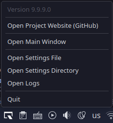

# About

**Welcome to the WTQ docs!**

WTQ runs in the background, and enables sliding applications on- :material-arrow-down: and off :material-arrow-up: the screen in Quake style.

Supports:

- Windows **10** and **11**
- KDE Plasma **5** & **6** (Wayland only)

See [Installation](#installation) to get started.

---

Here's an example where WTQ runs on **Windows 10**, toggling [Windows Terminal](), [Double Commander](), [Process Hacker]() and [KeePassXC]().
<video controls loop>
<source src="/assets/video/wtq-win10.mp4" />
</video>

And here's one on **KDE Plasma 6**, toggling [WezTerm](), [Dolphin]() [System Monitor]() and [KeePassXC]().
<video controls loop>
<source src="/assets/video/wtq-kde6.mp4" />
</video>

!!! note "Why "Quake" Style"
	The game [Quake (by id Software)](https://en.wikipedia.org/wiki/Quake_(video_game)) is generally considered the game that popularized toggling of the console onto the screen, by sliding it from the top.
	See [this video](https://www.youtube.com/watch?v=sDrDK7BigEc) for an example of what that looked like.

!!! note "The "WTQ" Name"
	WTQ initially started as a companion app for Microsoft's thrilling sequel to the classic command prompt; [Windows Terminal](https://github.com/microsoft/terminal).
	Fit that with Quake-style toggling, and you get **"Windows Terminal Quake"**.

	Much later, support for other terminals was added, and support for toggling apps that were not terminals at all.

	So now I refer to it as **"WTQ"**, not having the balls to straight up rename it.

## :material-download: Installation 

### :fontawesome-brands-windows: Windows

#### Scoop

[A command-line installer for Windows.](https://scoop.sh/)

```shell
scoop install https://raw.githubusercontent.com/flyingpie/windows-terminal-quake/master/scoop/wtq-latest.json
```
A shortcut is then available named "**WTQ - Windows Terminal Quake**", or you can just run "**wtq**" from a command line or **Win+R**.


/// caption
Start menu entry after installation.
///

Update (just WTQ):
```shell
scoop update wtq-latest
```

#### WinGet

[The Windows package manager.](https://github.com/microsoft/winget-cli)

```shell
winget install windows-terminal-quake
```
You can then call "**wtq**" from the command line.

After having done that at least once, a shortcut will appear in the start menu, called "**WTQ - Main Window**".


/// caption
Start menu entry after installation.
///

Update (just WTQ):
```shell
winget upgrade windows-terminal-quake
```

See [the WinGet docs](https://learn.microsoft.com/en-us/windows/package-manager/winget/) for more information on how to use Winget.

!!! note "Where's WTQ Installed?"
	You can run

	```shell
	winget --info
	```

	To find out where apps are installed:
	```
	Windows Package Manager v1.10.340
	(...)
	Portable Package Root (User)       %LOCALAPPDATA%\Microsoft\WinGet\Packages
	```

#### Manual

See [the latest release](https://github.com/flyingpie/windows-terminal-quake/releases/latest), and pick a zip.

- **Self-Contained** Slightly larger, but does not require dependencies to be installed (i.e. .Net).
- **Framework-Dependent** Smaller, but requires .Net 9 to be installed.

### :fontawesome-brands-linux: Linux

#### Manual

See the [~/linux/install-or-upgrade-wtq.sh script](https://github.com/flyingpie/windows-terminal-quake/blob/master/linux/install-or-upgrade-wtq.sh) that downloads the latest version of WTQ, installs it to ```~/.local/share/wtq```, and creates a ```wtq.desktop``` file.

As a 1-liner:
```shell
bash <(curl -s https://raw.githubusercontent.com/flyingpie/windows-terminal-quake/refs/heads/master/linux/install-or-upgrade-wtq.sh)
```

And the [~/linux/uninstall-wtq.sh uninstall script](https://github.com/flyingpie/windows-terminal-quake/blob/master/linux/uninstall-wtq.sh).
```shell
bash <(curl -s https://raw.githubusercontent.com/flyingpie/windows-terminal-quake/refs/heads/master/linux/uninstall-wtq.sh)
```

!!! note "Settings File Remains"
	The WTQ settings are not removed by this script. These are usually located at ```~/.config/wtq```, also see [Settings](#settings).

#### Flatpak

!!! danger "TODO"

## :material-lightbulb: App examples

!!! danger "TODO"

## :material-cog: Settings

Settings are stored in a JSON file. The file can use the extension ```.json```, ```.jsonc``` or ```.json5```. The latter two are supported, so that editors like VSCode automatically switch to **"JSON with Comments"**.

!!! note "Where's My Settings File?"
	The file can be in several places, to support different use cases and preferences.

	You can quickly open either the settings _file_, or the _directory_ that contains the settings file by clicking the tray icon -> **Open Settings File**, or **Open Settings Directory**.

	
	/// caption
	Tray icon menu options.
	///

	Additionally, it's also displayed in the GUI, with a link for convenience.

	
	/// caption
	Settings location in the GUI.
	///

### Settings File Locations

#### :fontawesome-brands-windows: On Windows

These locations are considered, in order:

1. A path defined by an environment variable named ```WTQ_CONFIG_FILE``` (regardless of filename or extension)
2. Next to the WTQ executable
	- When using **Scoop**: ```C:\Users\username\scoop\apps\wtq-latest\current```
	- When using **WinGet**: ```C:\Users\username\AppData\Local\Microsoft\WinGet\Packages\flyingpie.windows-terminal-quake_Microsoft.Winget.Source_8wekyb3d8bbwe```
	- Or wherever else the ```wtq.exe``` file is
4. In **~/.config**
	- ```C:\users\username\.config\wtq.json```
5. In user home
	- ```C:\users\username\wtq.json```
6. In user home, as a dot file
	- ```C:\users\username\.wtq.json```
7. In app data 
	- ```C:\users\username\AppData\Roaming\wtq\wtq.json```

If no settings were found at any of these locations, WTQ creates a settings file at ```C:\Users\username\AppData\Roaming\wtq\wtq.jsonc```.

#### :fontawesome-brands-linux: On Linux

These locations are considered, in order:

1. A path defined by an environment variable named ```WTQ_CONFIG_FILE``` (regardless of filename or extension)
2. Next to the WTQ executable
	- When using the install script: ```/home/username/.local/share/wtq```
3. In ```$XDG_CONFIG_HOME```, if defined (following to the [XDG spec](https://specifications.freedesktop.org/basedir-spec/latest/))
	- ```/home/username/.config/wtq.json```
4. In **~/.config** (the default for XDG_CONFIG_HOME, if is it not defined)
	- ```/home/username/.config/wtq.json```
5. In user home
	- ```/home/username/wtq.json```
6. In user home, as a dot file
	- ```/home/username/.wtq.json```
7. :fontawesome-brands-windows: In app data
	- ```/home/username/.config/wtq.json```

If no settings were found at any of these locations, WTQ creates a settings file at ```$XDG_CONFIG_HOME```: ```/home/username/.config/wtq/wtq.jsonc```.

!!! danger "TODO"
	TODO: Detail how settings file is found.

!!! danger "TODO"
	TODO: Mention wtq.schema.json

!!! danger "TODO"
	TODO: Mention GUI

{{TEMPLATE__SETTINGS}}


TESTTESTTEST

{{ testvar1 }}

{{ wtqsettings }}



### {{ category.name }}



#### {{ group.name }}





TESTTESTTEST


## :material-excavator: Building From Source

!!! danger "TODO"

## :material-pencil-ruler: Architecture

!!! danger "TODO"

