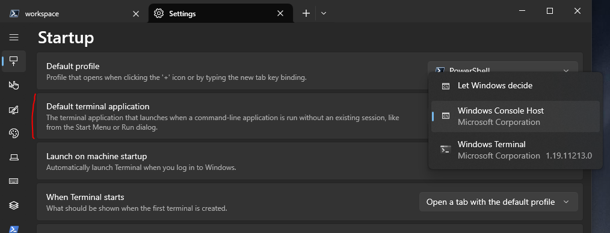
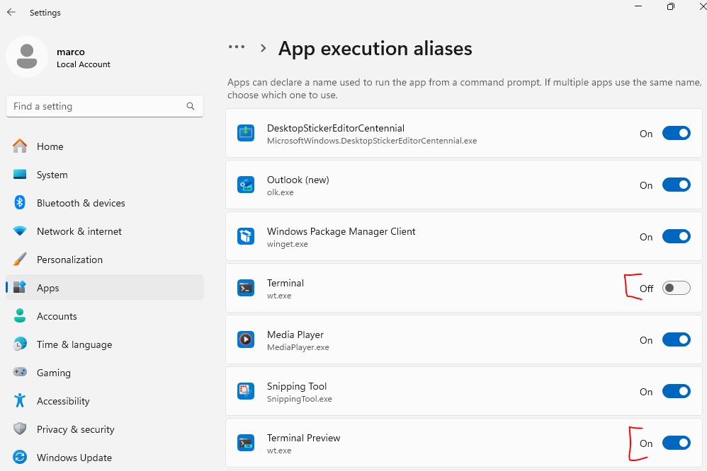

# Frequently Asked Questions

## WTQ Constantly Spawns New Command Prompts

This probably has to do with Windows Terminal capturing a process such as PowerShell.exe, pwsh.exe, or cmd.exe, and taking over its UI.
That makes the original UI unavailable to WTQ, causing it to attempt creating a new instance.

Here's what you can do about it:

#### Have WTQ control Windows Terminal directly
If you want to toggle Windows Terminal, you can point WTQ to it, instead of the current app, which is probably PowerShell.exe or something alike.

```json
{
	"Apps": [
		{
			"Name":			"Windows Terminal",
			"Hotkeys":		[{ "Modifiers": "Control", "Key": "D1" }],
			"FileName":		"wt",
			"ProcessName":	"WindowsTerminal"
		}
	]
}
```

#### Have Windows Terminal Not Attach To New Command Prompts
If you want to have separate windows for PowerShell.exe, pwsh.exe, cmd.exe, etc., configure Windows Terminal to not attach to them:



This can also be done from the Windows Settings:


## WTQ Doesn't Work Properly With The Windows Terminal Preview Version
This could have to do with the "wt.exe" alias not pointing to the correct Windows Terminal version.

In Windows Settings, look for "App execution aliases", and make sure that "wt.exe" is enabled for the desired version of Windows Terminal:


