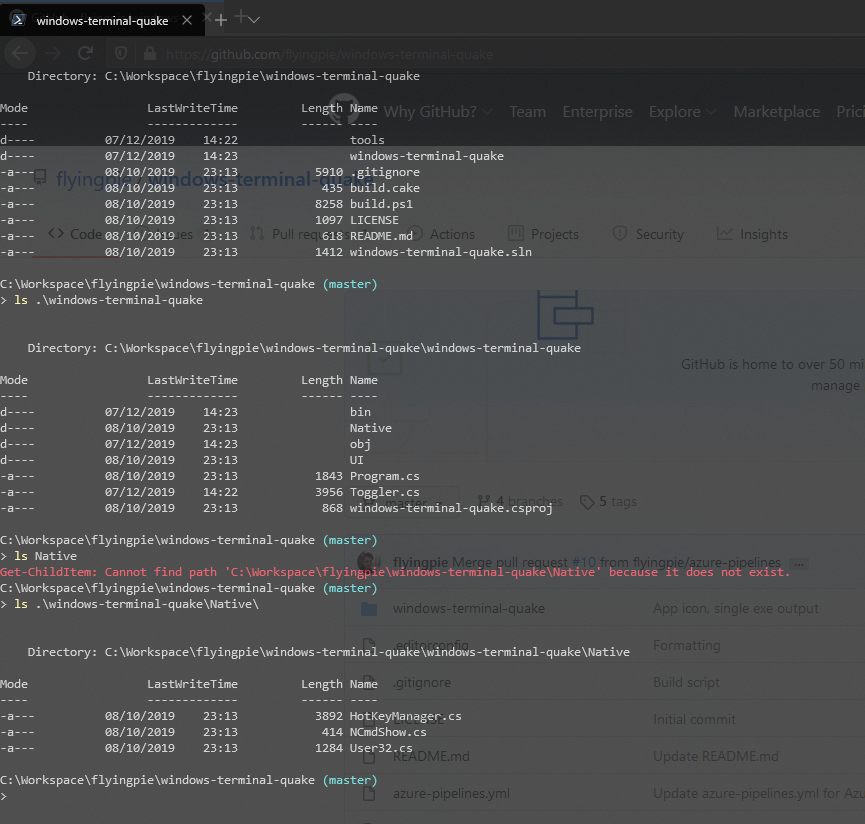

# Opacity

The terminal window can be made transparent through the ```Opacity```-setting.
Note that this controls the transparency of the entire window, including the title bar.

From ```0``` (invisible) to ```100``` (opaque).

## Global
```json
{
	"Opacity": 80
}
```

## Per App
```json
{
	"Apps": [
		{
			"Name": "Terminal",
			"Opacity": 80,
			...
		}
	]
}
```



<span class="by">Suggested by [ukWaqas](https://github.com/ukWaqas)</span>